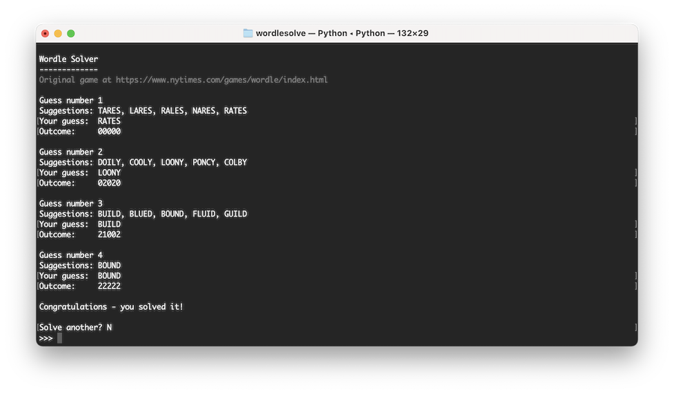
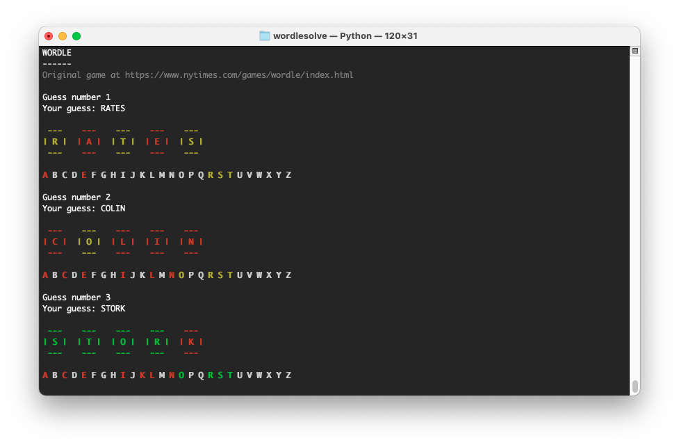
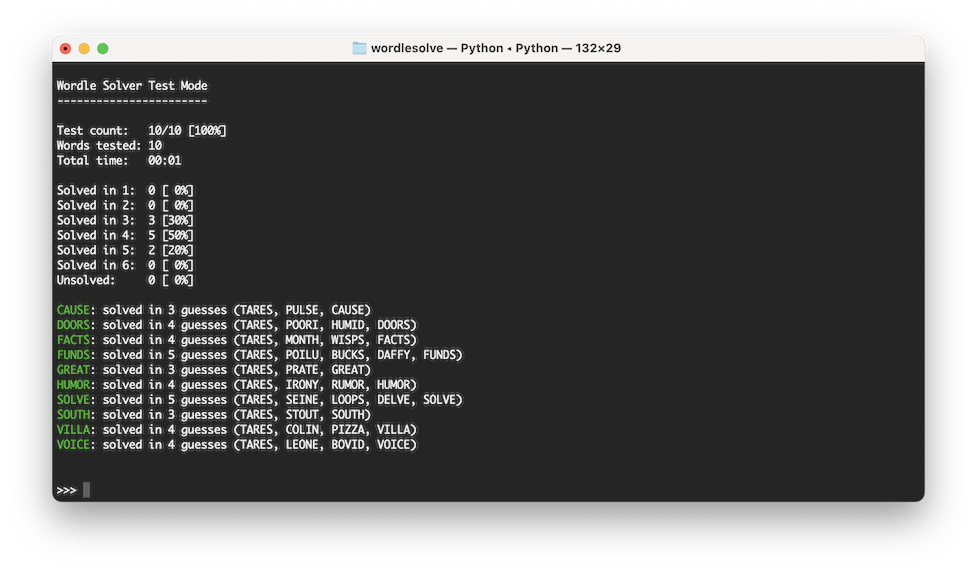

# wordlesolve
> wordlesolve solves Wordle!

*wordlesolve* will solve almost any Wordle puzzle within six guesses. Just follow the suggestions and type in the results.

## Installation

```sh
pip install wordlesolve
```

## Usage

### Solve mode

```sh
python3 -m wordlesolve
```
or
```sh
>>> from wordlesolve import Solver
>>> solver = Solver()
>>> solver.solve()
```

*wordlesolve* gives you up to five suggestions for each guess.
Type in the guess you use and the outcome Wordle gives for each letter: 0 for grey, 1 for yellow, 2 for green.

For example if you guess RATES and get


enter:
```sh
Your guess:  RATES
Outcome:     02100
````

*wordlesolve* will use that information to suggest some more guesses, getting you closer to the solution each time!



### Play mode

*wordlesolve* also includes a play mode - a console-based Wordle clone. Not nearly as good as [the real thing](https://www.nytimes.com/games/wordle/index.html) but fun to practise!

```sh
python3 -m wordlesolve -p
```
or
```sh
>>> from wordlesolve import Solver
>>> solver = Solver()
>>> solver.play()
```



### Test mode

Also included is a test mode - this was originally intended to test the algorithm during development. Test mode runs the solve algorithm against any number of solutions, either provided or randomly selected from the built-in database, and provides information on how quickly each was solved.

```sh
python3 -m wordlesolve -t -c 10 -v
```
or
```sh
>>> from wordlesolve import Solver
>>> solver = Solver()
>>> solver.test(count=10, verbosity=1)
```



### Options
Each *wordlesolve* mode takes a number of options, either as command line switches or keyword arguments.

<table>
    <tr>
        <th>Command line</th>
        <th>Keyword</th>
        <th>Type</th>
        <th>Description</th>
        <th>Solve mode</th>
        <th>Play mode</th>
        <th>Test mode</th>
    </tr>
    <tr>
        <td>&#8209;&#8209;hard</td>
        <td>hard</td>
        <td>bool</td>
        <td>Use hard mode</td>
        <td>yes</td>
        <td>yes</td>
        <td>yes</td>
    </tr>
    <tr>
        <td>-g &#8209;&#8209;guessfreq</td>
        <td>guess_freq</td>
        <td>float</td>
        <td>Minimum word frequency allowed for guesses</td>
        <td>yes</td>
        <td>yes</td>
        <td>yes</td>
    </tr>
    <tr>
        <td>&#8209;&#8209;solutionfreq</td>
        <td>solution_freq</td>
        <td>float</td>
        <td>Minimum word frequency allowed for solutions</td>
        <td>no</td>
        <td>yes</td>
        <td>yes</td>
    </tr>
    <tr>
        <td>-v &#8209;&#8209;verbosity</td>
        <td>verbosity</td>
        <td>count (cl) int (kw)</td>
        <td>Verbosity level for test results</td>
        <td>no</td>
        <td>no</td>
        <td>yes</td>
    </tr>
    <tr>
        <td>&#8209;&#8209;solutions</td>
        <td>solutions</td>
        <td>list[str]</td>
        <td>Solutions to test</td>
        <td>no</td>
        <td>no</td>
        <td>yes</td>
    </tr>
    <tr>
        <td>-f &#8209;&#8209;file</td>
        <td>filename</td>
        <td>str</td>
        <td>Path to a text file containing solutions to test (one word per line)</td>
        <td>no</td>
        <td>no</td>
        <td>yes</td>
    </tr>
</table>

## How it works

*wordlesolve* takes the result of each guess and builds a set of rules, for example:

```sh
Your guess:  RATES
Outcome:     02100
````

will generate five rules:

- There is no R in the solution
- There is at least one A, including one in second position
- There is at least one T but not in third position
- There is no E
- There is no S

*wordlesolve* will then filter its database of five-letter words to keep only those that match the rules. In this case there are 113 matching words, including FAITH, FAULT, PAINT, HABIT and VAULT.

*wordlesolve* analyses all matching words and counts letter frequency, i.e. in how many words each letter appears once, twice, etc. So of the 113 matching words, 44 have at least one letter N, but only 2 contain the letter X. A similar analysis is run for the position of each letter, so for example 52 of the 113 words begin with the letter T, and 39 end with the letter T.

*wordlesolve* applies a mask to these counts, to remove any letters or positions that are already known e.g. as there is no E in the solution, all E scores will be set to zero; because we know there is an A in position 2, no score will be given for an A in position 2.

*wordlesolve* then returns to the full list of words and scores each word according to these frequency and position scores. If a word contains at least one letter N, it will gain 44 points; if it begins with a T it will gain 52, etc. (In hard mode only the list of matching words is analysed rather than the full word list)

These scores are added together to give each word a total, indicating how useful the word will be in confirming or eliminating the remaining matches. Based on this list, *wordlesolve* makes up to five suggestions for the next guess.

## Word frequency

*wordlesolve* has a database of almost 13,000 five-letter words (the same list used in the original Wordle game). Many of these words are quite obscure and will not be known to most users. For that reason wordlesolve uses [the wordfreq library](https://github.com/rspeer/wordfreq) to use only more frequently encountered words wherever appropriate.

wordfreq is used in 2 ways:
* To set minimum word frequency limits for guesses or solutions via keyword arguments guess_freq / solution_freq or their command line equivalents
* To tie-break between words with equal scores (the more frequent word will be preferred)

The [``wordfreq.zipf_frequency()``](https://github.com/rspeer/wordfreq/blob/11a3138cea5f46d2229a110c1774ac64a2fcd92b/wordfreq/__init__.py#L305) function is used throughout - for the words in the *wordlesolve* database this gives a frequency of between 0.0 (very rare) and 6.4 (very common).

## But why?

Wordle is fun to play - that's why it's been so successful. The idea of writing a Wordle solver was not to spoil anyone's fun, it was just an interesting challenge.

Inspired by [this blog post](https://deepnote.com/@the21st/Wordle-Jan-18-2022-qsrZVCpiQACl-eli3JZFWg) flagged by [Pycoder's Weekly](https://pycoders.com/issues/509) I thought this would be fun to try - and it was.

Feel free to play around and let me know what you think.

## Release History

* 0.1.0
    * Initial release

## Meta

Neil Martin – neilmartin12@me.com

Distributed under the MIT license. See ``LICENSE`` for more information.

[https://github.com/neilmartin12/wordlesolve](https://github.com/neilmartin12/wordlesolve)

